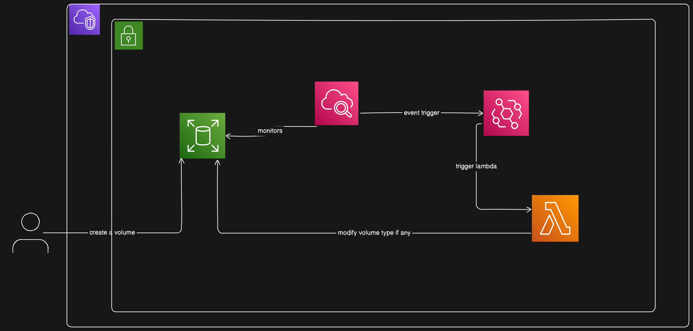

# aws-compliance
AWS compliance checker in regards to the resources that are created by devs/ people from the organization

## 🥷🏻 This Project is like a `GateKeeper` that safeguards an Organization by keeping all the **AWS resources** to adhere with the defined Company compliance.

### 🏗️ Infrastructure using Terraform (IaC)

#### 🖥️ Lambda
- Modifies any of the volume type `gp3` if `gp3` is not used
- Makes sure everything is in compliance
-

#### ⏰ Cloudwatch alerts and rules
- Cloudwatch rules/ events invoke the Lambda function
- We need to add policy to cloudwatch to invoke the lambda function(Target)

#### Architecture

#### Can refer to add sematic versioning to this blog: [semvar blog](https://dev.to/sahanonp/how-to-setup-semantic-release-with-github-actions-31f3)
